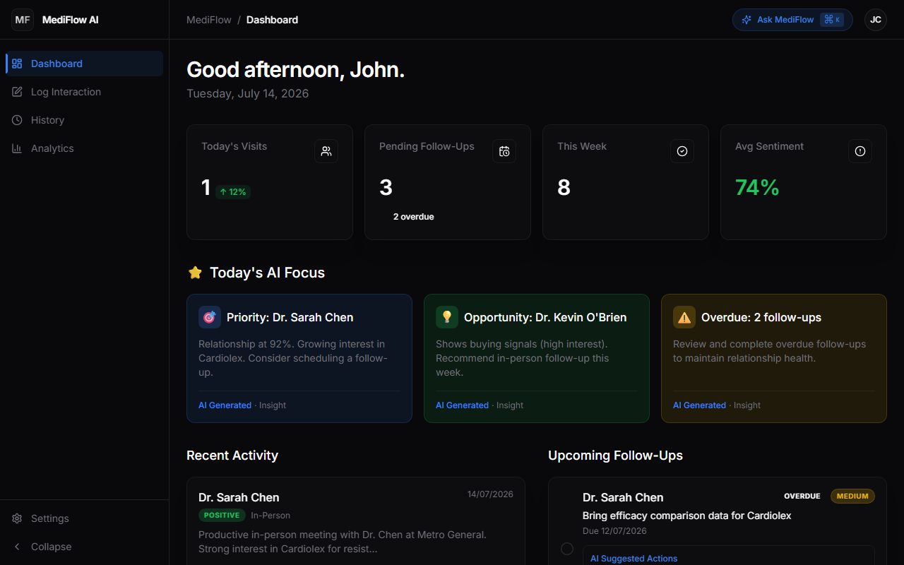
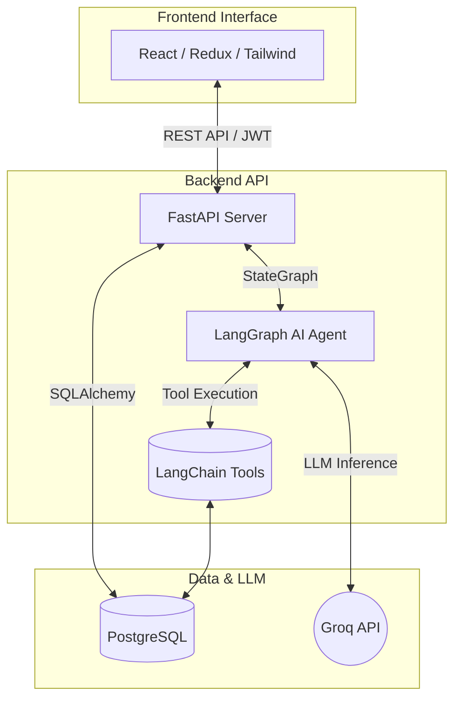

# MediFlow AI

AI-first Healthcare CRM powered by LangGraph, Groq, and FastAPI, designed specifically for pharmaceutical field representatives interacting with Healthcare Professionals (HCPs).



## 🌟 Features

- **AI Copilot Workspace**: Seamlessly toggle between structured forms and conversational interaction logging. Dictate or type raw notes and let the AI extract structured metadata.
- **Smart Interaction Logging**: Automatically detects intent, categorizes interactions, assesses sentiment, and tracks mentioned products.
- **Next Best Action Engine**: Replaces traditional static reminders with intelligent, context-aware follow-up suggestions (e.g., "Send clinical trial data because Dr. Chen expressed concerns about efficacy").
- **AI Meeting Brief**: Generates talking points, predicts objections, and scores the opportunity for upcoming visits based on historical interaction data.
- **Relationship Health Score**: A dynamically calculated score (0-100) for every HCP based on engagement frequency and sentiment.
- **Interaction Timeline**: A master-detail view of past interactions, displaying AI executive summaries and territory analytics.
- **Global Command Palette**: An `AskMediFlow` overlay allowing the user to query the agent from anywhere in the application.

## 🛠️ Tech Stack

### Frontend
- **React** (Vite)
- **Redux Toolkit** (State Management)
- **Tailwind CSS & shadcn/ui** (Styling & Components)
- **Framer Motion** (Micro-animations)
- **Recharts** (Data Visualization)

### Backend
- **FastAPI** (Async API framework)
- **LangGraph** (Stateful Agent Workflow)
- **Groq** (LLM Provider - `gemma2-9b-it`)
- **PostgreSQL** (Relational Database)
- **SQLAlchemy** (Async ORM)

## 📐 Architecture



## 📁 Folder Structure

```
c:\interview\
├── backend/
│   ├── agent/            # LangGraph StateGraph, Tools, and Prompts
│   ├── api/              # FastAPI Routes and Pydantic Schemas
│   ├── auth/             # JWT Authentication logic
│   ├── database/         # SQLAlchemy Models, DB Session, Seed Script
│   └── main.py           # FastAPI Application Entrypoint
├── frontend/
│   ├── src/
│   │   ├── api/          # Axios interceptors and API calls
│   │   ├── components/   # Reusable UI components (Sidebar, AI Copilot)
│   │   ├── pages/        # Main application views (Dashboard, Log Interaction)
│   │   └── store/        # Redux slices
│   └── vite.config.js    # Vite configuration
├── docs/
│   └── screenshots/      # Application screenshots
├── docker-compose.yml    # Full stack orchestration
└── .env                  # Environment variables
```

## 🚀 Installation & Setup

You do not need Node.js or Python installed locally. The entire application is containerized using Docker.

1. Clone the repository:
   ```bash
   git clone https://github.com/NIGHTRAIDER03/CRM.git
   cd CRM
   ```

2. Configure Environment Variables:
   Open the `.env` file at the root of the project and add your Groq API key:
   ```env
   GROQ_API_KEY=your_groq_api_key_here
   ```

3. Build and run the containers:
   ```bash
   docker-compose up --build -d
   ```

4. Access the application:
   - Frontend: `http://localhost:5173`
   - Backend API Docs: `http://localhost:8000/docs`

*Note: The database is automatically seeded with demo data on startup. You can log in using `demo` / `demo123`.*

## 🧠 LangGraph Flow

The AI Agent operates on a cyclic `StateGraph` that manages the conversation and tool execution:

1. **User Input**: The user submits unstructured notes or a command via the UI.
2. **Intent Detection (LLM)**: The LLM analyzes the input and decides which tool to call based on its system prompt.
3. **Tool Execution**: The graph transitions to a specific tool node (e.g., `log_interaction`, `schedule_followup`, `generate_meeting_brief`).
4. **State Update**: The tool executes (interacting with the PostgreSQL database) and updates the global graph state.
5. **Response Generation**: The LLM formats the tool output into a user-friendly executive summary and streams it back to the frontend.

## 🧰 AI Tools (Mandatory Requirements)

The agent is equipped with 6 specific tools to handle CRM operations:
1. `smart_hcp_search`: Resolves physician names and extracts context.
2. `log_interaction`: Extracts structured JSON (sentiment, products, summary) from raw notes.
3. `edit_interaction`: Allows retroactive modifications to logged visits.
4. `schedule_followup`: Identifies and logs actionable next steps.
5. `interaction_timeline`: Retrieves historical context for a specific HCP.
6. `generate_meeting_brief`: Synthesizes past data into a preparation brief for upcoming visits.

## 📸 Screenshots

*(To be added: Please place screenshots in `docs/screenshots/`)*
- `dashboard.png`: Main analytics overview.
- `copilot.png`: The AI Log Interaction workspace.
- `timeline.png`: Historical interaction timeline.
- `brief.png`: AI-Generated Meeting Brief.