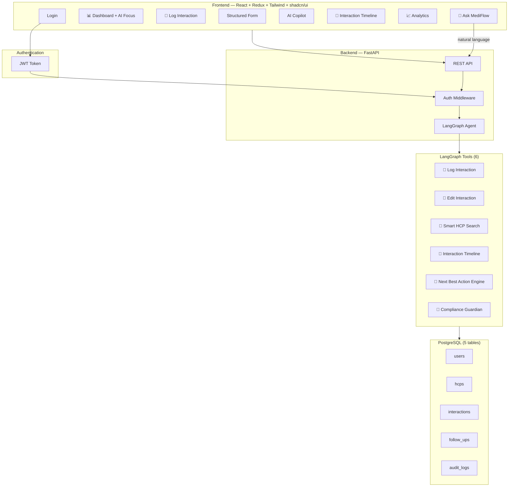
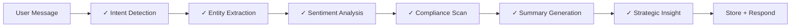
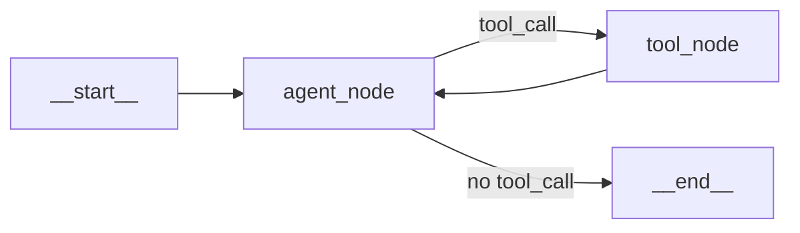

# MediFlow AI — Final Implementation Plan (v4)

## Overview

**MediFlow AI** is an AI-first CRM for pharmaceutical field representatives. AI is not a feature — it IS the product. Every screen, every interaction, every piece of data is AI-enhanced. The system features **6 LangGraph tools**, dual-mode interaction logging (structured form + AI Copilot), a personalized dashboard, rich timeline, analytics, compliance monitoring, and **AI Meeting Briefs** — powered by **Groq's gemma2-9b-it**.

**Project Name**: MediFlow AI
**Logo**: "MF" monogram — simple, professional
**Tagline**: "Intelligence for Life Sciences"
**Theme**: Dark only — one polished theme, no toggle

> **Core Principle**: 6 tools that work perfectly. Beautiful UI. Clean architecture. Confident explanation. If you can't demo it, don't build it.

> **Priority Focus**: Dashboard → Log Interaction (Form + AI Copilot) → All 6 LangGraph Tools → AI Thinking Panel → Timeline → Ask MediFlow

---

## Architecture



---

## AI Processing Pipeline

Every AI Copilot message passes through this pipeline — each step animated live in the **AI Thinking Panel**:



---

## Component 1: Database (PostgreSQL — 5 Tables)

#### [NEW] `backend/database/models.py`

| Table | Key Columns | Purpose |
|-------|-------------|---------|
| `users` | `id`, `email`, `password_hash`, `full_name`, `role` (rep/manager), `territory`, `is_active`, `created_at` | Sales rep accounts |
| `hcps` | `id`, `name`, `specialty`, `institution`, `city`, `state`, `email`, `phone`, `npi_number`, `tier` (A/B/C), `preferred_contact_method`, `relationship_score` (float 0-100), `engagement_data` (JSON — tracks visit count, avg sentiment, follow-up completion rate), `notes`, `created_at`, `updated_at` | Healthcare professionals — includes computed relationship health |
| `interactions` | `id`, `hcp_id` (FK), `user_id` (FK), `interaction_date`, `interaction_type` (in-person/virtual/phone/email), `products_discussed` (JSON array), `key_topics`, `sentiment` (positive/neutral/negative), `sentiment_score` (float 0-1), `follow_up_date`, `follow_up_actions`, `ai_summary`, `ai_executive_summary` (JSON: key_outcomes, next_actions, risks), `ai_confidence` (float), `entities_extracted` (JSON), `compliance_flags` (JSON), `strategic_insight`, `notes`, `samples_dropped` (JSON array), `duration_minutes`, `location`, `created_at`, `updated_at` | Core interaction logs — products as JSON, executive summary format |
| `follow_ups` | `id`, `interaction_id` (FK), `hcp_id` (FK), `user_id` (FK), `due_date`, `action_description`, `ai_suggested_actions` (JSON array — AI-generated follow-up suggestions), `status` (pending/completed/overdue), `priority` (high/medium/low), `completed_at`, `created_at` | Follow-up tracking with AI suggestions |
| `audit_logs` | `id`, `user_id` (FK), `action`, `entity_type`, `entity_id`, `old_values` (JSON), `new_values` (JSON), `created_at` | Compliance audit trail |

> [!NOTE]
> - **`relationship_score`** on `hcps` is recomputed after every interaction (visits × sentiment × follow-up completion × recency)
> - **`ai_executive_summary`** stores structured summaries: `{ key_outcomes: [...], next_actions: [...], risks: [...], confidence: 0.94 }`
> - **`ai_suggested_actions`** on `follow_ups` stores AI-generated smart suggestions: `["Share clinical trial data", "Arrange product demo", "Deliver samples"]`

#### [NEW] `backend/database/db.py`
- Async SQLAlchemy engine with `asyncpg`
- Auto-create tables on startup
- Connection pooling

#### [NEW] `backend/database/seed.py`
- 1 demo user: `rep@mediflow.ai` / `demo123` (name: "John Carter", territory: "Northeast")
- 15 HCPs with varied specialties, tiers, and relationship scores
- 10 sample past interactions (realistic, varied sentiments, products, AI summaries)
- 5 pending follow-ups (2 overdue, 1 high priority, with AI suggestions)
- Pre-computed relationship scores and engagement data

#### [NEW] `docker-compose.yml`
PostgreSQL 16 Alpine — single service, volume-persisted.

---

## Component 2: Authentication

#### [NEW] `backend/auth/auth.py`
- JWT generation/validation (`python-jose`)
- Password hashing (`passlib[bcrypt]`)
- 24-hour expiry
- `get_current_user` dependency

#### [NEW] `backend/auth/routes.py`

| Method | Path | Purpose |
|--------|------|---------|
| `POST` | `/api/auth/login` | Login → JWT |
| `GET` | `/api/auth/me` | Current user |

---

## Component 3: LangGraph Agent (6 Tools)

#### [NEW] `backend/agent/graph.py`

**Enhanced State — AI Remembers People:**

```python
class AgentState(TypedDict):
    messages: Annotated[list, add_messages]

    # ⭐ AI remembers the PERSON, not just the name
    current_hcp: Optional[dict]               # Full HCP context
    hcp_memory: dict                          # Enriched memory:
    # {
    #   "last_product_discussed": "Cardiolex",
    #   "preferred_communication": "in-person",
    #   "typical_objections": ["side effects", "cost"],
    #   "buying_interest": "high",
    #   "last_sentiment": "positive",
    #   "relationship_score": 92,
    #   "visit_count": 7,
    #   "engagement_trend": "growing"
    # }

    current_interaction: Optional[dict]       # Active interaction
    current_follow_up: Optional[dict]         # Active follow-up
    conversation_context: list[str]           # Summary of tool outputs
    workflow_stage: str                       # idle|logging|editing|searching|preparing
    user_id: int                              # Authenticated user
```

When a user says *"How is Dr. Chen doing?"* — the agent already knows everything: last product, sentiment trend, relationship score, typical objections. No lookup needed.

**Graph:**


- **LLM**: `ChatGroq(model="gemma2-9b-it")`
- **Checkpointer**: `MemorySaver` with `thread_id`

#### [NEW] `backend/agent/prompts.py`

System prompt:
- *"You are MediFlow AI, an intelligent copilot for pharmaceutical field representatives."*
- Knows pharma terminology, compliance (Sunshine Act, anti-kickback, HIPAA)
- Returns **per-entity confidence scores** with every extraction
- Generates **executive summaries** (Key Outcomes, Next Actions, Risks)
- Generates **strategic insights** after every log
- Generates **smart follow-up suggestions** (not just dates — actual actions)
- Can prepare **meeting briefs** by analyzing interaction history
- Shows response metadata: model name, response time

#### [NEW] `backend/agent/tools.py`

| # | Tool Name | Input | AI Logic | Output |
|---|-----------|-------|----------|--------|
| 1 | **`log_interaction`** | Free-text or structured data | Extract entities → sentiment → compliance scan → executive summary (key outcomes, next actions, risks) → smart follow-up suggestions → strategic insight → update HCP relationship score | `{ interaction, confidence: { doctor: 0.98, product: 0.96, sentiment: 0.91, follow_up: 0.95 }, executive_summary: { key_outcomes, next_actions, risks }, compliance: { status, flags }, strategic_insight, suggested_follow_ups: [...] }` |
| 2 | **`edit_interaction`** | `interaction_id` + fields | Validate → update → audit log → re-run compliance if content changed → recompute HCP relationship score | Updated record + audit entry |
| 3 | **`smart_hcp_search`** | Name, specialty, or natural language | ILIKE fuzzy search → return matches with **relationship health score**, engagement trend, last interaction, tier | List of HCPs with relationship context |
| 4 | **`interaction_timeline`** | HCP name/id, optional date range | Query chronologically → compute engagement trend → sentiment trajectory → **meeting brief** data | Timeline + trend analysis + engagement graph data |
| 5 | **`next_best_action`** | HCP name/id | Analyze: past interactions, specialty, sentiment trends, product history, follow-up status, relationship score → generate **opportunity score** with reasoning → prioritized recommendations | `{ opportunity_score: 92, reasoning: ["Positive trend", "Recent visit", "High interest", "No compliance issues"], recommended_actions: [...], suggested_products: [...], meeting_prep: { last_meeting_summary, expected_questions, recommended_talking_points } }` |
| 6 | **`compliance_guardian`** | Text to scan | Detect: gift mentions, quid pro quo, off-label promotion, improper inducements, financial incentives | `{ status, flags: [...], severity, recommendation }` |

---

## Component 4: Backend API (FastAPI)

#### [NEW] `backend/main.py`
FastAPI with lifespan (DB init + seed), CORS.

#### [NEW] `backend/api/routes.py`

| Method | Path | Auth | Purpose |
|--------|------|------|---------|
| `POST` | `/api/chat` | ✅ | Send message to LangGraph agent |
| `GET` | `/api/interactions` | ✅ | List interactions (paginated, filterable) |
| `POST` | `/api/interactions` | ✅ | Create via form (runs AI summary + compliance on backend) |
| `PUT` | `/api/interactions/{id}` | ✅ | Update interaction |
| `GET` | `/api/interactions/{id}` | ✅ | Interaction detail |
| `GET` | `/api/hcps` | ✅ | List/search HCPs |
| `GET` | `/api/hcps/{id}` | ✅ | HCP detail + relationship score + engagement data |
| `GET` | `/api/hcps/{id}/meeting-brief` | ✅ | ⭐ AI Meeting Brief for pre-visit prep |
| `GET` | `/api/dashboard` | ✅ | Dashboard stats + AI focus items |
| `GET` | `/api/analytics` | ✅ | Chart data |
| `GET` | `/api/follow-ups` | ✅ | Pending/overdue follow-ups (computed from DB) |
| `PUT` | `/api/follow-ups/{id}` | ✅ | Mark complete |
| `GET` | `/api/search` | ✅ | Global search HCPs + interactions |

#### [NEW] `backend/api/schemas.py`
Pydantic request/response models.

---

## Component 5: Frontend (React + Redux + Tailwind + shadcn/ui)

#### Project Setup
- **Vite** + React
- **Tailwind CSS** (dark only — no light theme config needed)
- **shadcn/ui** (Radix-based, copied into project)
- **Framer Motion** (animations)
- **Lucide React** (icons, 1.5px stroke)
- **Recharts** (charts)
- **React Hook Form + Zod** (forms)
- **@reduxjs/toolkit + react-redux**
- **react-router-dom**
- **axios** (with JWT interceptor)
- **react-hot-toast**
- **@fontsource/inter**

---

#### Redux Store — `frontend/src/store/`

| Slice | State | Key Actions |
|-------|-------|-------------|
| `authSlice` | `user`, `token`, `isAuthenticated` | `login`, `logout`, `loadUser` |
| `chatSlice` | `messages[]`, `isLoading`, `threadId`, `thinkingSteps[]`, `currentEntities`, `executiveSummary`, `strategicInsight` | `sendMessage`, `clearChat`, `addThinkingStep`, `setEntities` |
| `interactionSlice` | `interactions[]`, `current`, `isLoading`, `filters` | `fetchInteractions`, `createInteraction`, `updateInteraction` |
| `hcpSlice` | `hcps[]`, `currentHcp`, `meetingBrief`, `searchResults` | `fetchHCPs`, `searchHCPs`, `fetchMeetingBrief` |
| `dashboardSlice` | `stats`, `recentActivity`, `followUps`, `aiFocus` | `fetchDashboard` |
| `analyticsSlice` | `chartData`, `dateRange` | `fetchAnalytics` |
| `uiSlice` | `activeMode`, `sidebarCollapsed`, `askMediFlowOpen` | `toggleMode`, `toggleSidebar`, `toggleAskMediFlow` |

---

#### Pages

##### `LoginPage.jsx`

```
┌─────────────────────────────────────────────┐
│                                             │
│         (animated gradient mesh bg)         │
│                                             │
│              ┌──────────┐                   │
│              │    MF    │  ← monogram       │
│              └──────────┘                   │
│                                             │
│           MediFlow AI                       │
│        Intelligence for                     │
│         Life Sciences                       │
│                                             │
│      ┌──────────────────────┐               │
│      │  rep@mediflow.ai     │               │
│      ├──────────────────────┤               │
│      │  ••••••••            │               │
│      ├──────────────────────┤               │
│      │     Sign In →        │               │
│      └──────────────────────┘               │
│                                             │
└─────────────────────────────────────────────┘
```

- Full-screen, centered card (max 400px)
- Animated gradient mesh background (slow drift — CSS only, subtle)
- "MF" monogram logo
- Display text: "MediFlow AI" with gradient accent
- Tagline: "Intelligence for Life Sciences"
- Clean form, no distractions

---

##### `DashboardPage.jsx`

```
┌─────────────────────────────────────────────────────────────┐
│  Good afternoon, John.                                      │
│  Monday, July 14, 2025                                      │
├─────────────┬──────────────┬──────────────┬─────────────────┤
│ Today's     │ Pending      │ This Week    │ Avg Sentiment   │
│ Visits      │ Follow-Ups   │ Interactions │ Score           │
│   3  ↑12%   │   5  (2 ⚠️)  │    12        │  87%   ↑        │
├─────────────┴──────────────┴──────────────┴─────────────────┤
│                                                             │
│  ⭐ Today's AI Focus                                        │
│  ┌─────────────────────────────────────────────────────┐    │
│  │ 🎯 Priority: Dr. Sarah Chen — relationship at 92%  │    │
│  │    Growing interest in Cardiolex. Schedule demo.    │    │
│  │                                                     │    │
│  │ 💡 Opportunity: Dr. Patel shows buying signals     │    │
│  │    Recommend in-person follow-up this week.         │    │
│  │                                                     │    │
│  │ ⚠️ Compliance: Review yesterday's interaction #47  │    │
│  │    Flagged language needs attention.                 │    │
│  └─────────────────────────────────────────────────────┘    │
│                                                             │
│  Recent Activity              │  Upcoming Follow-Ups        │
│  ┌───────────────────┐        │  ┌───────────────────┐      │
│  │ ● Dr. Chen        │        │  │ 🔴 Dr. Patel      │      │
│  │   Positive · 2h   │        │  │    Overdue · High  │      │
│  │ ● Dr. Williams    │        │  │ 🟡 Dr. Chen       │      │
│  │   Neutral · 1d    │        │  │    Tomorrow · Med  │      │
│  │ ● Dr. Patel       │        │  │ ⚪ Dr. Kim        │      │
│  │   Positive · 2d   │        │  │    July 20 · Low   │      │
│  └───────────────────┘        │  └───────────────────┘      │
│                                                             │
│  [ Log Interaction ]  [ View All History ]                  │
└─────────────────────────────────────────────────────────────┘
```

- **Personalized greeting** with time-of-day awareness
- **4 stat cards** with animated counters + trend arrows
- **⭐ Today's AI Focus** — priority doctor, opportunity, compliance reminder (AI-generated on dashboard load)
- **Recent Activity** mini-timeline (last 5, compact)
- **Upcoming Follow-Ups** with priority pills (🔴 High / 🟡 Medium / ⚪ Low) and overdue warnings
- Quick action buttons

---

##### `LogInteractionPage.jsx` — The Core Screen

**Mode toggle:** two-segment control → `Form` | `AI Copilot`

**Form Mode** (two-column desktop):

Left:
- HCP selector (searchable dropdown via `smart_hcp_search`)
- Date picker
- Interaction type (pill selector: In-Person / Virtual / Phone / Email)
- Products discussed (multi-select tag input)

Right:
- Key topics (textarea)
- Sentiment (visual: 😊 / 😐 / 😟)
- Follow-up date + actions
- Notes

Bottom submit bar → backend runs AI on submit → returns:
- Executive Summary card (Key Outcomes, Next Actions, Risks)
- Confidence score
- Compliance status
- Smart follow-up suggestions
- Badge: `AI Enhanced ✓`

**AI Copilot Mode:**

```
┌──────────────────────────────────┬──────────────────────┐
│  AI Copilot                      │  Context Panel       │
│                                  │                      │
│  ┌─────────────────────────┐     │  Dr. Sarah Chen      │
│  │ I met Dr. Chen today    │ You │  Cardiologist         │
│  │ at Metro Hospital...    │     │  Tier A · Metro Hosp  │
│  └─────────────────────────┘     │  Relationship ████ 92%│
│                                  │                      │
│  ┌─────────────────────────┐     │  AI Thinking         │
│  │ I've logged your inter- │ AI  │  ✓ Intent Detected   │
│  │ action with Dr. Chen... │     │  ✓ Doctor Found (98%)│
│  │                         │     │  ✓ Product (96%)     │
│  │ ┌─ Tool: log_interaction─┐   │  ✓ Sentiment (91%)   │
│  │ │ ✅ Interaction Logged  │   │  ✓ Compliance ✓      │
│  │ │                       │   │  ✓ Summary Done      │
│  │ │ Executive Summary     │   │                      │
│  │ │ ▸ Key Outcomes        │   │  Confidence          │
│  │ │ ▸ Next Actions        │   │  Doctor     98% ████ │
│  │ │ ▸ Risks               │   │  Product    96% ████ │
│  │ │ AI Enhanced ✓         │   │  Sentiment  91% ███  │
│  │ │                       │   │  Follow-up  95% ████ │
│  │ │ Powered by Gemma2-9B  │   │                      │
│  │ │ 0.84 sec              │   │  Strategic Insight    │
│  │ └───────────────────────┘   │  Dr. Chen has shown   │
│  └─────────────────────────┘     │  increasing interest  │
│                                  │  in Cardiolex...      │
│  ┌──────────────────────[Send]┐  │                      │
│  │ Type a message...          │  │  [ Prepare Meeting ] │
│  └────────────────────────────┘  │                      │
└──────────────────────────────────┴──────────────────────┘
```

Key UI elements:
- **AI Thinking Panel** (right panel) — animated step checkmarks appear one by one
- **Entity Confidence Cards** — per-entity bars (Doctor 98%, Product 96%, etc.)
- **Tool Result Cards** — inline, collapsible, show executive summary format
- **AI Enhanced ✓** badge on every AI-processed interaction
- **"Powered by Gemma2-9B · 0.84 sec"** footer on AI responses
- **Strategic Insight** card after interaction log
- **Smart Follow-Up Suggestions** — AI-generated action items, not just dates
- **Relationship Score** visible in HCP context card
- **"Prepare Meeting" button** in context panel → triggers meeting brief
- Empty state when no HCP: *"Start by mentioning a doctor... 'I met Dr. Smith today at City Hospital'"*

---

##### ⭐ AI Meeting Brief (Killer Feature)

Accessible from: HCP context panel button, HCP detail page, dashboard priority card, or Ask MediFlow (*"Prepare me for Dr. Chen"*)

```
┌─────────────────────────────────────────────┐
│  📋 Meeting Brief — Dr. Sarah Chen          │
│  Generated by MediFlow AI                   │
│                                             │
│  Relationship Health  ████████░░  87%        │
│  Engagement Trend     📈 Growing             │
│                                             │
│  ── Last Meeting ──                         │
│  July 10 · In-Person · Positive             │
│  Discussed Cardiolex for resistant HTN.     │
│  Requested clinical trial data.             │
│  Dropped 5 samples.                         │
│                                             │
│  ── Products History ──                     │
│  Cardiolex (3 meetings) · NeuroPro (1)      │
│                                             │
│  ── Recommended Talking Points ──           │
│  ✓ Share Phase III clinical trial results   │
│  ✓ Address side effect concerns (raised 2x) │
│  ✓ Propose product demonstration            │
│                                             │
│  ── Expected Questions ──                   │
│  • Long-term side effects?                  │
│  • Comparison with competitor drug?         │
│  • Insurance coverage?                      │
│                                             │
│  ── Open Follow-ups ──                      │
│  🔴 Deliver samples (overdue)              │
│  🟡 Email research paper (tomorrow)        │
│                                             │
│  Opportunity Score  ████████░░  88%          │
│                                             │
│  Powered by Gemma2-9B · 1.2 sec            │
│  AI Enhanced ✓                              │
└─────────────────────────────────────────────┘
```

The **`/api/hcps/{id}/meeting-brief`** endpoint calls the LangGraph agent to analyze all past interactions for that HCP and generate this brief. This is the feature that demonstrates **practical AI value beyond summarization** — exactly what a pharma rep wants before walking into a clinic.

---

##### `InteractionHistoryPage.jsx` — Rich Timeline

```
┌─────────────────────────────────────────────┐
│  Filters: [Date ▾] [HCP ▾] [Product ▾]     │
│           [Sentiment ▾] [Type ▾]            │
│                                             │
│  Today                                      │
│  ──●── Dr. Sarah Chen · In-Person           │
│    │   AI Enhanced ✓                        │
│    │   Positive 😊 · Cardiolex              │
│    │   "Discussed resistant HTN..."         │
│    │   Relationship ████ 92%                │
│    │   [Expand] [Edit] [Prepare Meeting]    │
│    │                                        │
│  Yesterday                                  │
│  ──●── Dr. James Williams · Virtual         │
│    │   AI Enhanced ✓                        │
│    │   Neutral 😐 · NeuroPro               │
│    │   "Follow-up on previous..."          │
│    │   Relationship ███░ 74%               │
│    │   [Expand] [Edit] [Prepare Meeting]    │
│    │                                        │
│  July 11                                    │
│  ──●── Dr. Priya Patel · Phone              │
│    │   ...                                  │
└─────────────────────────────────────────────┘
```

- Vertical timeline with date separators
- Color-coded nodes (🟢 positive / 🟡 neutral / 🔴 negative)
- Each card shows: HCP, type, sentiment, AI summary preview, relationship score, AI Enhanced badge
- Expandable to full executive summary
- **"Prepare Meeting" button** on each card
- **Engagement trend** indicator (📈 Growing / 📉 Declining / ➡️ Stable)
- Staggered entrance animations (50ms per node)
- Empty state: *"No interactions logged yet. Start by logging your first HCP meeting."* + CTA button

---

##### `AnalyticsPage.jsx`

- Date range: 7d | 30d | 90d preset buttons
- 2×2 chart grid:
  - **Interactions per Week** (smooth area chart)
  - **Top Products Discussed** (horizontal bar)
  - **Sentiment Distribution** (donut — green/yellow/red)
  - **Follow-Up Completion Rate** (progress ring)
- Below: **Top HCPs table** (name, relationship score bar, last visit, engagement trend arrow)
- All charts use custom dark palette (not default Recharts)
- Animate on mount

---

#### Components — `frontend/src/components/`

| Component | Purpose |
|-----------|---------|
| **Layout** | |
| `Layout.jsx` | App shell: sidebar + header + main |
| `Sidebar.jsx` | Linear-style — icons + small labels, 240px → 64px collapsible, active left accent bar |
| `Header.jsx` | Vercel-style — breadcrumbs left, "Ask MediFlow" button right (replaces search ⌘K), user avatar |
| `ProtectedRoute.jsx` | JWT route guard |
| **AI Core** | |
| `AIThinkingPanel.jsx` | ⭐ Animated step-by-step: Intent → Entities → Sentiment → Compliance → Summary → Insight |
| `EntityConfidenceCards.jsx` | ⭐ Per-entity confidence bars: Doctor 98%, Product 96%, etc. |
| `StrategicInsightCard.jsx` | ⭐ AI recommendation card after interaction log |
| `ExecutiveSummary.jsx` | ⭐ Key Outcomes, Next Actions, Risks format |
| `MeetingBrief.jsx` | ⭐ Full AI meeting prep card |
| `ComplianceAlert.jsx` | Warning/violation banner |
| `AskMediFlow.jsx` | ⭐ Global AI command palette |
| `ToolResultCard.jsx` | Inline tool output (collapsible, with AI Enhanced badge) |
| `AIBadge.jsx` | "AI Enhanced ✓" micro-badge |
| `PoweredByFooter.jsx` | "Powered by Gemma2-9B · 0.84 sec" |
| **Interaction** | |
| `ChatWindow.jsx` | Message list + input textarea + send |
| `ChatMessage.jsx` | Message bubble (user/AI) |
| `InteractionForm.jsx` | Structured form (React Hook Form + Zod) |
| `ModeToggle.jsx` | Animated Form ↔ AI Copilot segment control |
| `InteractionCard.jsx` | Timeline card (expandable) |
| **HCP** | |
| `HCPCard.jsx` | HCP info + relationship score bar + engagement trend |
| `RelationshipScore.jsx` | ⭐ Visual bar: `████████░░ 92%` |
| `EngagementTrend.jsx` | ⭐ 📈 Growing / 📉 Declining / ➡️ Stable |
| **Dashboard** | |
| `StatCard.jsx` | Metric with animated counter + trend arrow |
| `AIFocusCard.jsx` | ⭐ Today's AI Focus: priority, opportunity, compliance |
| `SmartFollowUpList.jsx` | ⭐ AI-suggested follow-up actions |
| **UI Primitives** | |
| `LoadingSkeleton.jsx` | Shimmer loading |
| `EmptyState.jsx` | Illustrated empty states with CTA |
| `SentimentBadge.jsx` | Color-coded sentiment |
| `ConfidenceBadge.jsx` | Percentage with color scale |

---

#### ⭐ Ask MediFlow — Global AI Command Bar

Header button: **"Ask MediFlow"** (replaces generic search ⌘K)

Opens Linear-style command palette:

```
┌─────────────────────────────────────────────┐
│  🔮 Ask MediFlow...                         │
│  ─────────────────────────────────────────── │
│  Show doctors needing follow-up              │
│  Which HCPs discussed Cardiolex?             │
│  Summarize this week's visits                │
│  Who is my highest priority doctor?          │
│  Prepare me for Dr. Chen                     │
│  Check compliance: "doctor wants gifts"      │
│  ─────────────────────────────────────────── │
│  Powered by Gemma2-9B                        │
└─────────────────────────────────────────────┘
```

Same `/api/chat` endpoint, fresh thread. Results rendered in-modal. The unforgettable feature — users ask instead of navigating.

---

#### Design System — Dark Only

> Inspired by **Linear** (precision), **Vercel** (dark elegance), **Apple HIG** (clarity). No Bootstrap. No Material UI. No light theme — one polished dark theme.

**Colors:**
```
bg-base:       #09090B     (true dark)
bg-surface:    #0F0F12     (cards, sidebar)
bg-elevated:   #18181B     (modals, dropdowns)
bg-hover:      #1E1E22
border-subtle: rgba(255,255,255,0.06)
border:        rgba(255,255,255,0.10)
text-primary:  #FAFAFA
text-secondary:#A1A1AA
text-muted:    #71717A
accent:        #3B82F6
accent-hover:  #2563EB
accent-subtle: rgba(59,130,246,0.12)
success:       #22C55E
warning:       #EAB308
danger:        #EF4444
```

**Typography:** Inter — 11/13/14/15/18/24/32/48px with `cv02, cv03, cv04, cv11` features

**Radius:** 6px buttons → 8px cards → 12px modals → 9999px pills

**Spacing:** 8px grid (4/8/12/16/20/24/32/40/48/64)

**Animations (Framer Motion):**
| What | Duration | Note |
|------|----------|------|
| Page transition | 200ms | `y: 8→0`, opacity |
| Card hover | 150ms | `y: -1px`, border shift |
| Button press | 100ms | `scale: 0.98` |
| Modal | 200ms | `scale: 0.98→1` |
| Chat message | 250ms | `y: 8→0` |
| Stat counter | 800ms | count 0→value |
| AI thinking step | 300ms | `opacity: 0→1`, staggered |
| Timeline node | 300ms | staggered 50ms, `x: -8→0` |
| Tool running | continuous | progress bar fill |
| Skeleton shimmer | 1.5s | infinite gradient sweep |

**Tool execution animation:**
```
Tool: log_interaction
├─ Running...    ████████░░░░
├─ Success ✅
└─ [Expand results]
```
Not instant — shows Running → Progress → Success. Tiny. Huge impact.

---

## Project File Structure

```
c:\interview\
├── docker-compose.yml
├── README.md
│
├── backend/
│   ├── main.py
│   ├── requirements.txt
│   ├── .env.example
│   ├── auth/
│   │   ├── __init__.py
│   │   ├── auth.py
│   │   └── routes.py
│   ├── database/
│   │   ├── __init__.py
│   │   ├── db.py
│   │   ├── models.py
│   │   └── seed.py
│   ├── agent/
│   │   ├── __init__.py
│   │   ├── graph.py
│   │   ├── tools.py
│   │   └── prompts.py
│   └── api/
│       ├── __init__.py
│       ├── routes.py
│       └── schemas.py
│
├── frontend/
│   ├── package.json
│   ├── vite.config.js
│   ├── tailwind.config.js
│   ├── postcss.config.js
│   ├── index.html
│   ├── components.json
│   └── src/
│       ├── main.jsx
│       ├── App.jsx
│       ├── index.css
│       ├── lib/
│       │   └── utils.js
│       ├── api/
│       │   └── axios.js
│       ├── store/
│       │   ├── store.js
│       │   ├── authSlice.js
│       │   ├── chatSlice.js
│       │   ├── interactionSlice.js
│       │   ├── hcpSlice.js
│       │   ├── dashboardSlice.js
│       │   ├── analyticsSlice.js
│       │   └── uiSlice.js
│       ├── pages/
│       │   ├── LoginPage.jsx
│       │   ├── DashboardPage.jsx
│       │   ├── LogInteractionPage.jsx
│       │   ├── InteractionHistoryPage.jsx
│       │   └── AnalyticsPage.jsx
│       └── components/
│           ├── Layout.jsx
│           ├── Sidebar.jsx
│           ├── Header.jsx
│           ├── ProtectedRoute.jsx
│           ├── ChatWindow.jsx
│           ├── ChatMessage.jsx
│           ├── ToolResultCard.jsx
│           ├── AIThinkingPanel.jsx
│           ├── EntityConfidenceCards.jsx
│           ├── StrategicInsightCard.jsx
│           ├── ExecutiveSummary.jsx
│           ├── MeetingBrief.jsx
│           ├── ComplianceAlert.jsx
│           ├── AskMediFlow.jsx
│           ├── AIBadge.jsx
│           ├── PoweredByFooter.jsx
│           ├── InteractionForm.jsx
│           ├── ModeToggle.jsx
│           ├── HCPCard.jsx
│           ├── RelationshipScore.jsx
│           ├── EngagementTrend.jsx
│           ├── InteractionCard.jsx
│           ├── StatCard.jsx
│           ├── AIFocusCard.jsx
│           ├── SmartFollowUpList.jsx
│           ├── LoadingSkeleton.jsx
│           ├── EmptyState.jsx
│           ├── SentimentBadge.jsx
│           └── ConfidenceBadge.jsx
```

---

## Open Questions

> [!IMPORTANT]
> **Groq API Key**: Needed from [console.groq.com](https://console.groq.com). App reads `GROQ_API_KEY` from `.env`. Do you have one?

> [!NOTE]
> **PostgreSQL via Docker**: `docker-compose up -d` for zero-config. Need Docker installed.

---

## Verification Plan

### 6 Tool Demos

| # | Prompt | Tool | Expected |
|---|--------|------|----------|
| 1 | *"Look up Dr. Sarah Chen"* | `smart_hcp_search` | HCP card + relationship 92% + engagement trend 📈 |
| 2 | *"I met Dr. Chen today at Metro Hospital. Discussed Cardiolex for resistant hypertension. Very receptive. Wants clinical trial data. Dropped 5 samples."* | `log_interaction` | ✅ Logged + Executive Summary (Key Outcomes, Next Actions, Risks) + Confidence (Doctor 98%, Product 96%, Sentiment 91%, Follow-up 95%) + Strategic Insight + Smart Follow-ups + AI Enhanced ✓ + "Powered by Gemma2-9B · 0.84s" |
| 3 | *"Show me my history with Dr. Chen"* | `interaction_timeline` | Rich timeline + engagement trend |
| 4 | *"Update my last interaction — change sentiment to neutral"* | `edit_interaction` | ✅ Updated + audit log |
| 5 | *"What's the best action for Dr. Chen?"* | `next_best_action` | Opportunity Score 88% + reasoning + recommendations + meeting prep data |
| 6 | *"The doctor agreed to prescribe our medicine exclusively if we sponsor her conference travel"* | `compliance_guardian` | 🚫 VIOLATION: Quid pro quo, severity CRITICAL |

### Demo Flow
1. **Login** → animated gradient, "Intelligence for Life Sciences"
2. **Dashboard** → greeting, stats, Today's AI Focus
3. **Log Interaction (Form)** → submit → AI summary card appears
4. **Log Interaction (AI Copilot)** → watch AI Thinking Panel animate step by step
5. **Smart HCP Search** → relationship score visible
6. **Edit Interaction** → audit trail
7. **Next Best Action** → opportunity score with reasoning
8. **Compliance Guardian** → violation warning
9. **Interaction Timeline** → rich vertical timeline
10. **Meeting Brief** → full pre-visit prep
11. **Analytics** → charts
12. **Ask MediFlow** → "Who needs follow-up?" → instant answer

---

## Execution Order

1. Docker + PostgreSQL
2. Backend: database models + seed data
3. Backend: JWT auth
4. Backend: LangGraph agent + 6 tools + prompts
5. Backend: FastAPI routes + schemas
6. Frontend: Vite + Tailwind + shadcn/ui scaffolding
7. Frontend: Redux store
8. Frontend: Login page
9. Frontend: Layout (Sidebar + Header + ProtectedRoute)
10. Frontend: Dashboard (greeting + stats + AI Focus + follow-ups)
11. Frontend: Log Interaction — Form mode
12. Frontend: Log Interaction — AI Copilot + Thinking Panel + Context Panel
13. Frontend: Interaction History — Timeline
14. Frontend: Meeting Brief
15. Frontend: Analytics
16. Frontend: Ask MediFlow
17. Frontend: Polish — loading skeletons, empty states, tool animations, AI badges
18. Integration testing
19. README
